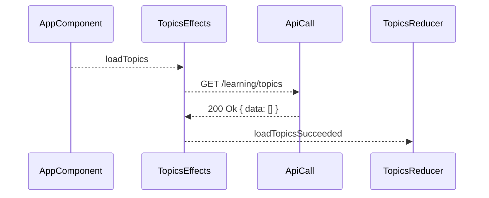

# Redux Effects

## Loading Topics

Before Refactor

```mermaid
sequenceDiagram
AppComponent-->>TopicsEffects: loadTopics
TopicsEffects-->>ApiCall: GET /learning/topics
ApiCall-->>TopicsEffects: 200 Ok { data: [] }
TopicsEffects-->>TopicsReducer: loadTopicsSucceeded
```
